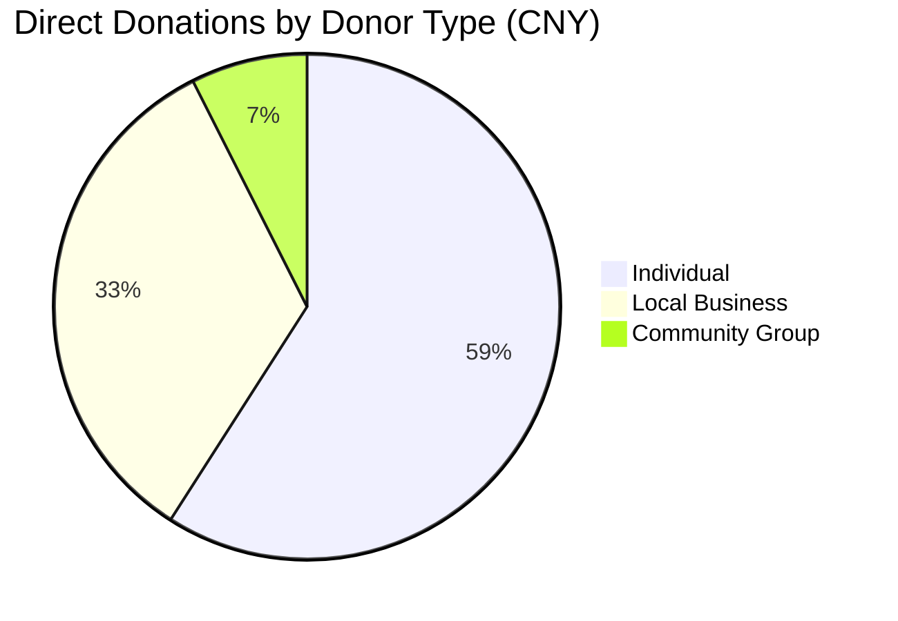
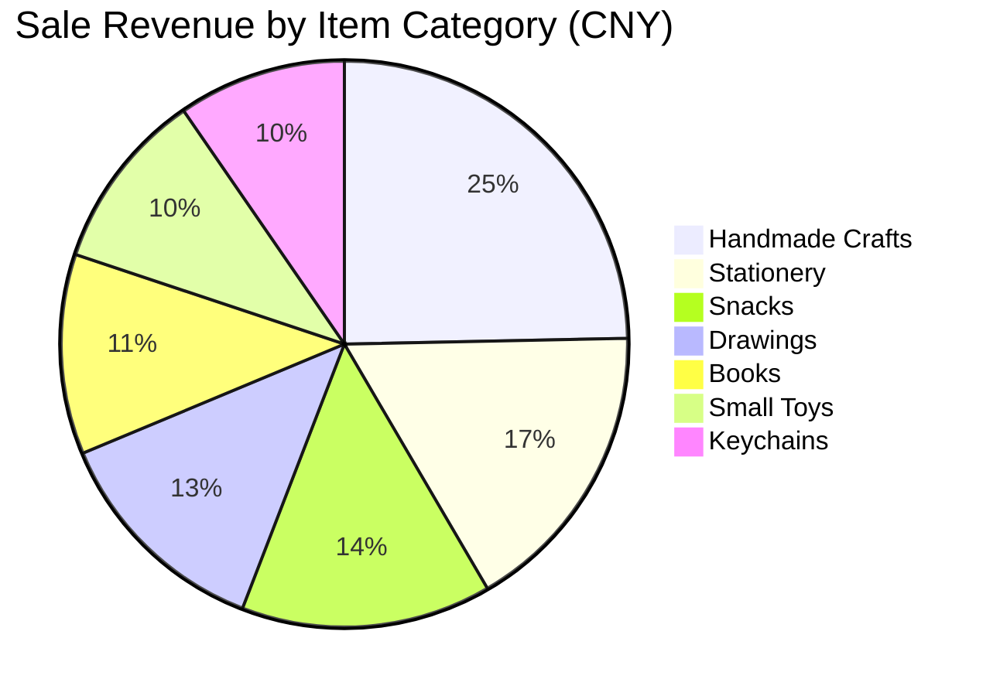

# Community Charity Donation Analysis

## Project Overview

I built this project after helping organize records from a community charity
event called "Children's Hearts, Warm Sunset." The event included direct
donations and a small charity sale. The purpose was to support special-needs
children and elderly people living alone.

I removed all real names, school names, phone numbers, and organization names
before putting the data into this project. Individual donors are written as
`Donor_001`, `Donor_002`, and so on. Business donors are written as
`Business_001`, `Business_002`, and so on.

The project is simple on purpose. I wanted to practice turning messy activity
records into tables, charts, and a short report that I could actually explain.

## Data Note

The data in this repository is an anonymized and cleaned version of event
records. I did not upload original paper forms, phone numbers, real names, or
organization names because they are private.

Some labels were simplified, such as donor names, business names, item
categories, and team names. This project is for learning data organization and
basic analysis. It should not be treated as an official financial record.

I also added a short [data dictionary](docs/data_dictionary.md) to explain the
cleaned CSV columns.

## Why I Built This Project

During the event, the donation records came from different places. Some records
were direct donations, while others came from items sold during the charity sale.
At first, the numbers were just lists in a spreadsheet.

I wanted to answer a few basic questions.

Question 1: How much money came from direct donations?

Question 2: Which donor type gave the most?

Question 3: Which charity sale items brought in the most revenue?

Question 4: Which volunteer team handled the largest total contribution?

Question 5: What should I record more carefully next time?

## Tools Used

I used Python, pandas, matplotlib, CSV files, and unittest.

## Project Timeline

May 2026: I made the first version of the dataset and wrote the main analysis
script.

Late May 2026: I added simple charts, summary CSV files, and tests for the main
totals.

June 2026: I plan to improve the notes, add clearer charts, and write a better
final event report.

The roadmap in `docs/development_roadmap.md` lists small updates I can make
over time.

## Key Findings

Finding 1: Direct donations were much larger than charity sale income. This
makes sense because several donors gave one-time amounts, while sale income came
from lower-priced items and also had simple item costs.

Finding 2: Individual donors gave the largest total amount in this dataset. I
expected business donors to be the largest group, so this was useful to check
with the table instead of guessing.

Finding 3: Handmade crafts had the highest sale revenue among the item
categories. They did not have the largest number of units sold, but their price
per item was higher than many small items.

Finding 4: Team C had the highest combined total from direct donations and sale
activity. Most of this came from direct donations, not from the sale table.

Finding 5: The sale records were useful, but cost tracking needs to be more
detailed next time.

## Chart Preview

The script creates chart image files after it runs. I also added two simple
chart previews here so the main results are easy to see on GitHub.





## Challenges

Challenge 1: Some original records were handwritten, so I had to decide how to
organize the data before analyzing it.

Challenge 2: I did not want to include private information, so I anonymized all
donor and organization names.

Challenge 3: The charity sale data had both revenue and cost, so I had to
separate total sales from net contribution.

Challenge 4: I had to check my totals with tests because my first manual totals
were not always correct.

## What I Learned

Lesson 1: Clean data structure matters before making charts.

Lesson 2: Small tests are useful even for a simple project.

Lesson 3: A chart can make the result easier to understand, but the chart still
needs a clear title and labels.

Lesson 4: An honest project does not need to look perfect. It should show what I
did, what I checked, and what I would improve.

## Future Improvements

Improvement 1: Add a short data quality checklist for the two CSV files.

Improvement 2: Add a chart that compares direct donations and sale income side
by side.

Improvement 3: Improve the daily trend chart so it is easier to read.

Improvement 4: Add more tests for team totals and category totals.

## Project Structure

```text
community-charity-donation-analysis/
+-- data/
    +-- donations.csv
    +-- sale_records.csv
+-- docs/
    +-- development_roadmap.md
    +-- data_dictionary.md
+-- reports/
+-- src/
    +-- analyze_charity_sale.py
+-- tests/
    +-- test_analysis.py
+-- README.md
+-- requirements.txt
```

## How to Run the Project

Install the packages:

```bash
pip install -r requirements.txt
```

Run the analysis:

```bash
python src/analyze_charity_sale.py
```

Run the tests:

```bash
python -m unittest discover -s tests
```

After running the script, the project creates summary tables in `reports/` and
chart image files in `outputs/figures/`.
