# Community Charity Sale Data Operations Analysis


## Project Overview

This project analyzes anonymized donation, inventory, sale, and booth planning
records from a community charity sale that raised over ¥26,000. I supported the
data and operations side of the event by counting donated items, categorizing
inventory, estimating item values, maintaining online spreadsheets, helping
with item allocation and booth layout planning, tracking preparation progress,
and reviewing post-event data.

The goal of this project is to show how simple data organization, Python
analysis, visualization, and beginner-friendly machine learning experiments can
support a real community charity activity.

## My Role

- Counted and categorized donated items before the event
- Estimated item values before the sale
- Maintained online spreadsheets for donations, inventory, and preparation work
- Supported item allocation across teams and booth areas
- Helped organize booth layout planning
- Tracked preparation progress before the event
- Reviewed post-event donation, inventory, sale, and booth records
- Used Python to create an anonymized analysis project after the event

## Why This Project Matters

Charity sale work is not only about collecting and selling items. When many
items, donors, teams, and booth areas are involved, clear records can make the
event easier to prepare, explain, and improve. This project connects community
service with basic data operations, data cleaning, charts, simple models, and
written reflection.

## Key Results

- Total direct donations: ¥22,678
- Total sale revenue: ¥5,269
- Total funds raised in the sample analysis: ¥27,947
- Direct donations made up the larger part of the total funds
- Sale revenue was reviewed by category, team, and booth area
- Booth-level comparison helped review table allocation
- Team contribution summaries combined donation and sale support
- Estimate vs actual sale price comparisons helped review pricing decisions

This repository is not an official financial report or audit. It is an
anonymized student data analysis project based on the structure of real event
records.

## Data Source and Anonymization

The dataset in this repository is sample-based and adapted from the structure
of real event records. I removed or replaced private details before building
the public version of the project.

The sample files use anonymous IDs such as `Donor_001`, `Business_001`,
`Team A`, and `Booth A`. They do not include real donor names, student names,
phone numbers, emails, addresses, school names, organization names, QR codes,
or payment account details.

## Activity Evidence and Privacy

The images below show parts of the charity sale and related community event.
All visible faces, private names, contact details, QR codes, and sensitive text
have been blurred for privacy.

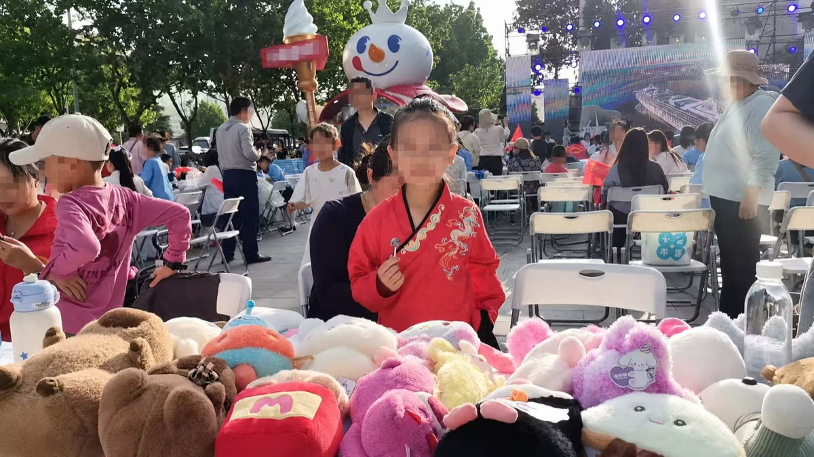

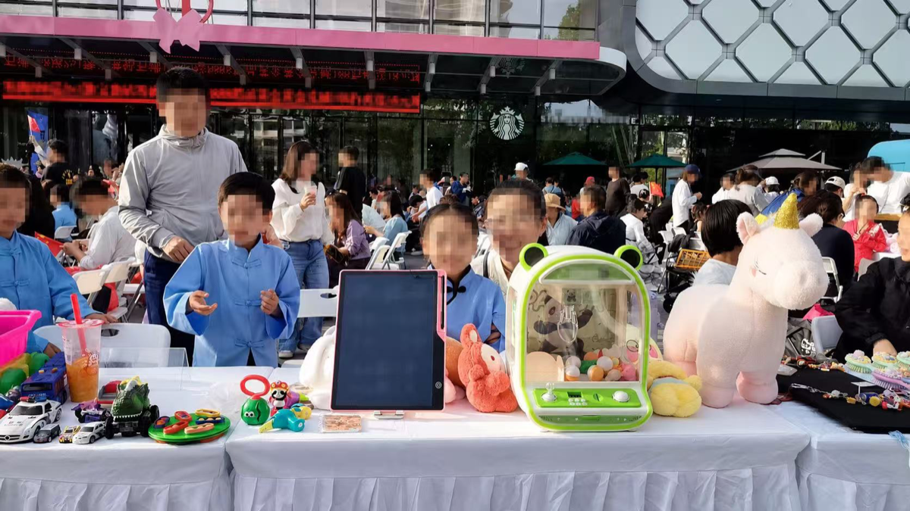


## Key Visualizations

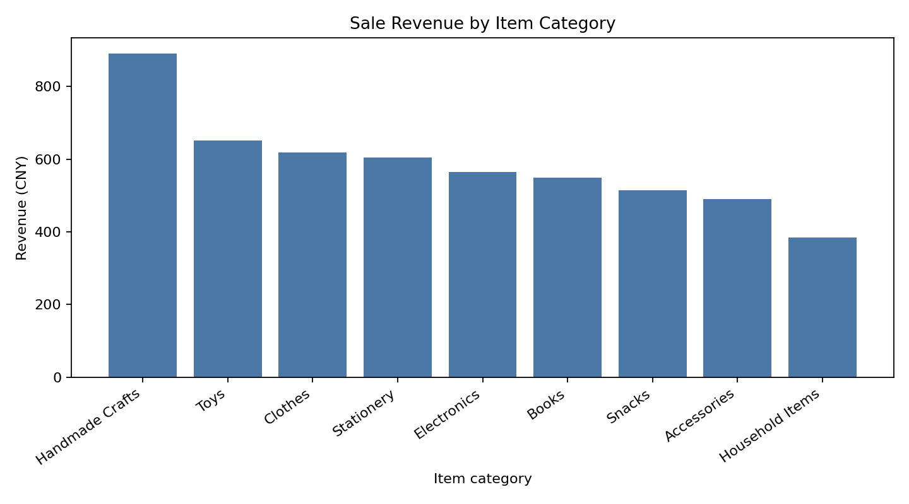

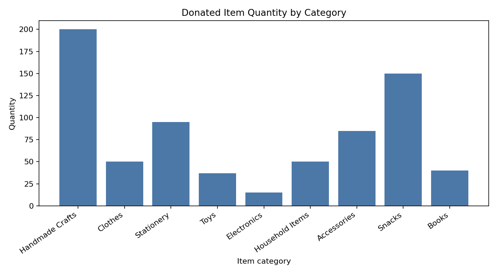

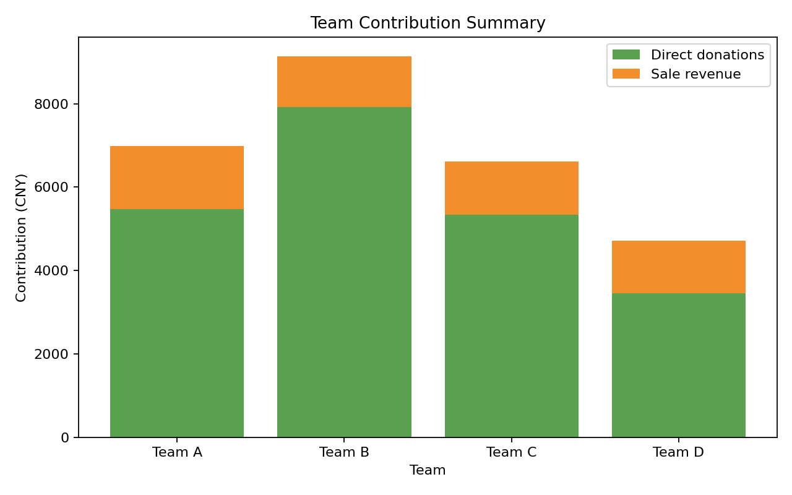

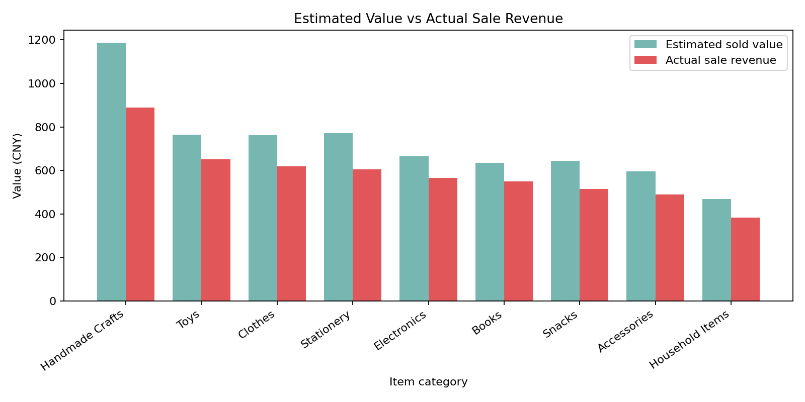

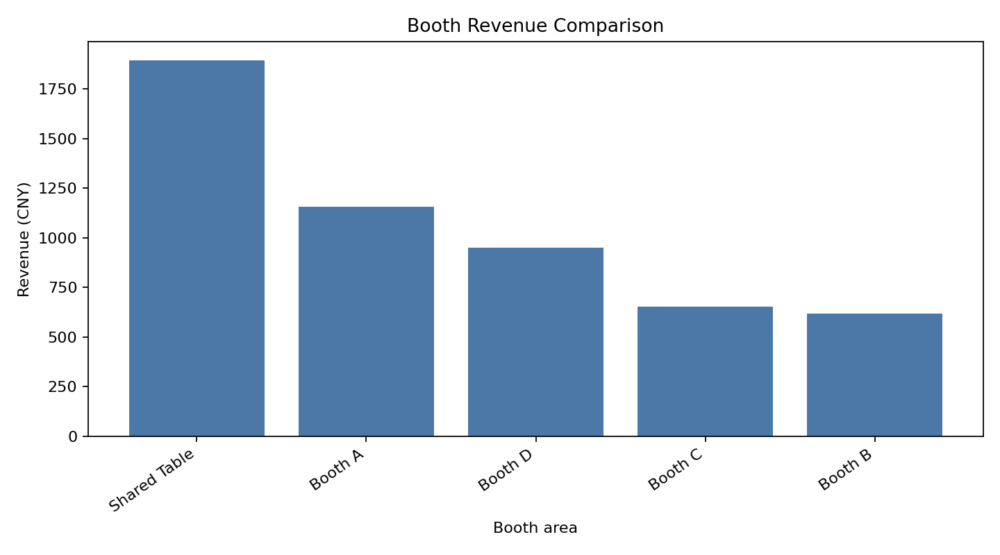

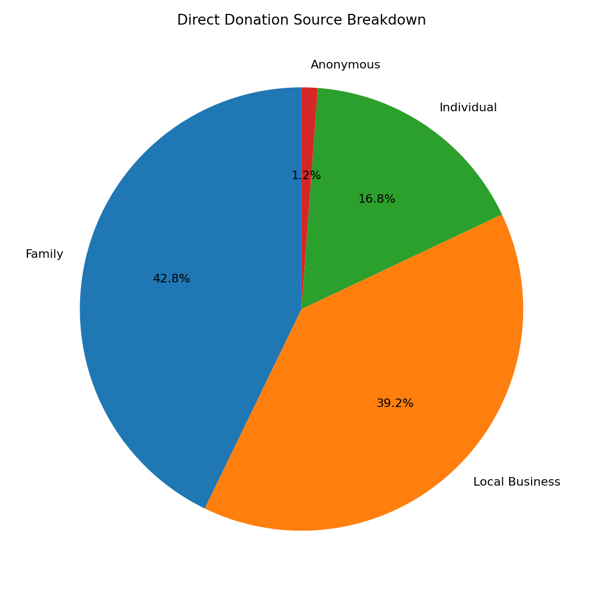

## Interactive Dashboard

The Streamlit dashboard allows users to explore donation, inventory, sale,
booth, and model summary results with filters for team, item category, booth
area, and item condition.

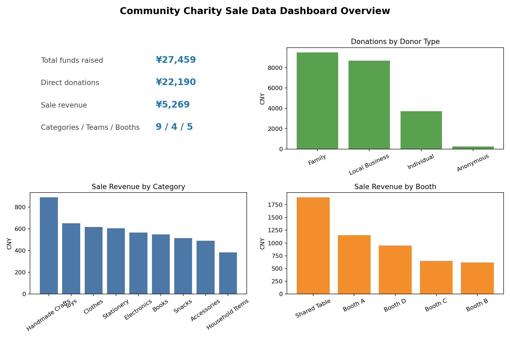

Run the dashboard:

```bash
streamlit run dashboard/app.py
```

## Simple Machine Learning Experiments

I added two beginner-friendly machine learning experiments to explore the
charity sale data.

The price prediction regression model predicts `final_unit_price_cny` using:

- item category
- item condition
- estimated unit value
- booth area
- team
- donated quantity

For the price model, the input features come from the inventory table. The sale
records are used only to calculate the target value, `final_unit_price_cny`.

The sale success classification model predicts whether an item group is likely
to sell using:

- item category
- item condition
- estimated unit value
- booth area
- team
- quantity

Models used:

- Linear Regression
- Random Forest Regressor
- Logistic Regression
- Decision Tree Classifier

Metrics used:

- MAE
- RMSE
- R2 score
- accuracy
- precision
- recall
- confusion matrix

The models are exploratory learning experiments, not official decision-making
tools. The dataset is small and anonymized, so the model results should be read
as part of event reflection.

Current sample results:

- Linear Regression price model: MAE 1.622, RMSE 2.128, R2 0.987
- Random Forest price model: MAE 2.747, RMSE 4.530, R2 0.943
- Logistic Regression sale success model: accuracy 1.000, precision 1.000, recall 1.000
- Decision Tree sale success model: accuracy 0.800, precision 1.000, recall 0.778

Some scores are very high because the sample dataset is small, clean, and
simple. I treat these results as a learning exercise and a way to reflect on
event data, not as proof of a reliable prediction system.
Because the dataset is small, the high model scores may reflect simple
patterns in the sample data rather than strong real-world prediction ability.

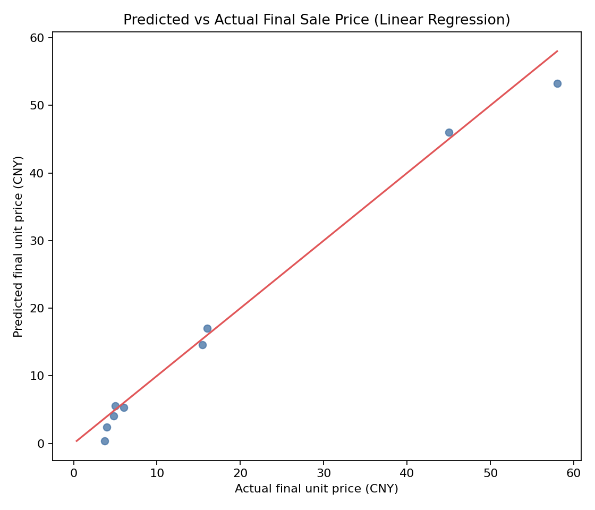

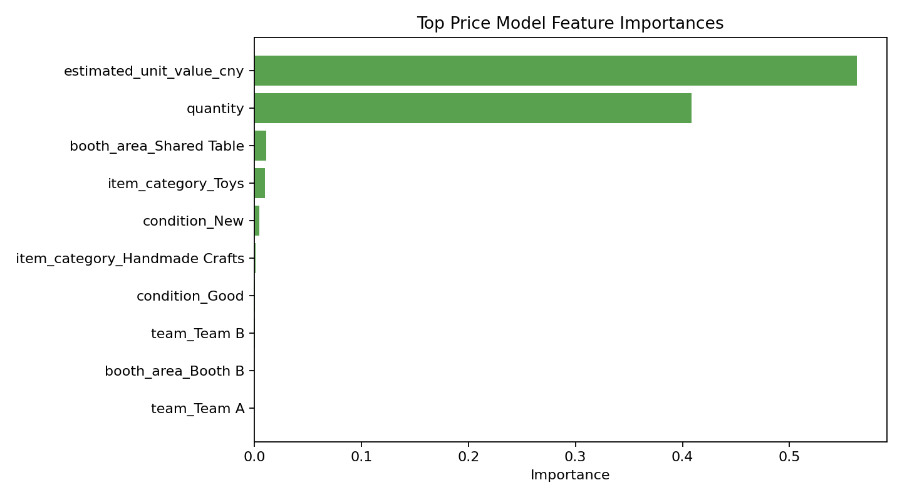

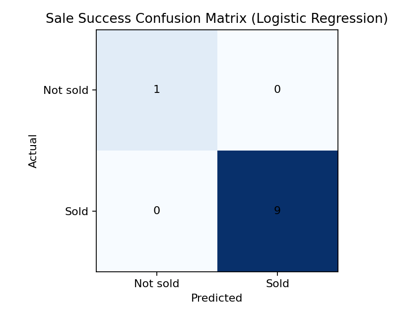

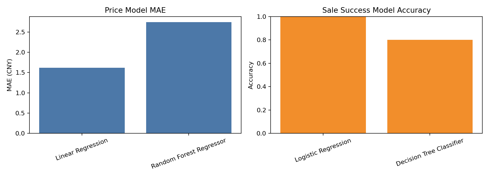

## Project Workflow

1. Collect donation, inventory, sale, and booth planning records
2. Remove or replace private information
3. Organize raw records into CSV files
4. Clean missing or inconsistent values
5. Validate sale totals and item IDs
6. Analyze donations, inventory, sales, and booth layout
7. Create summary tables and charts
8. Run simple machine learning experiments
9. Build an interactive dashboard
10. Write reports, documentation, and reflection notes
11. Run unit tests for calculations, outputs, and privacy checks

## Dataset Description

The sample data is anonymized and based on the structure of the event records.
It does not include real names, phone numbers, school names, organization
names, addresses, QR codes, payment account details, or private donor
information.

- `donation_records_sample.csv`: direct donation records by donor type and team
- `item_inventory_sample.csv`: item categories, quantities, estimated values, condition, and booth areas
- `sale_records_sample.csv`: item-level sale records and payment methods
- `booth_layout_sample.csv`: booth planning records and item allocation notes
- `merged_event_data.csv`: processed inventory and sale data joined by item ID

## How to Run

Install requirements:

```bash
pip install -r requirements.txt
```

Run the full workflow:

```bash
python src/run_all.py
```

Run tests:

```bash
python tools/format_audit.py
python -m unittest discover -s tests
```

Run the dashboard:

```bash
streamlit run dashboard/app.py
```

Manual script commands:

```bash
python src/clean_data.py
python src/analyze_donations.py
python src/analyze_inventory.py
python src/analyze_sales.py
python src/analyze_booth_layout.py
python src/create_charts.py
python src/train_price_model.py
python src/train_sale_success_model.py
python tools/format_audit.py
```

## Verification

The project can be checked with:

```bash
python tools/format_audit.py
python src/run_all.py
python -m unittest discover -s tests
python -m compileall src tests dashboard tools
python -m py_compile dashboard/app.py
```

## Project Structure

```text
community-charity-donation-analysis/
├── README.md
├── requirements.txt
├── .gitignore
├── data/
│   ├── raw/
│   │   ├── donation_records_sample.csv
│   │   ├── item_inventory_sample.csv
│   │   ├── sale_records_sample.csv
│   │   └── booth_layout_sample.csv
│   └── processed/
│       ├── cleaned_donations.csv
│       ├── cleaned_inventory.csv
│       ├── cleaned_sales.csv
│       ├── cleaned_booth_layout.csv
│       └── merged_event_data.csv
├── src/
│   ├── __init__.py
│   ├── utils.py
│   ├── clean_data.py
│   ├── analyze_donations.py
│   ├── analyze_inventory.py
│   ├── analyze_sales.py
│   ├── analyze_booth_layout.py
│   ├── create_charts.py
│   ├── model_utils.py
│   ├── train_price_model.py
│   ├── train_sale_success_model.py
│   └── run_all.py
├── dashboard/
│   └── app.py
├── models/
│   └── model_metrics.json
├── reports/
│   ├── final_charity_sale_report.md
│   ├── event_operation_review.md
│   ├── model_report.md
│   ├── summary_tables/
│   └── charts/
├── docs/
│   ├── images/
│   ├── project_background.md
│   ├── data_dictionary.md
│   ├── workflow_notes.md
│   ├── data_privacy_note.md
│   ├── methodology.md
│   ├── limitations.md
│   ├── reflection.md
│   └── future_improvements.md
├── notebooks/
│   └── charity_sale_analysis_walkthrough.md
├── tools/
│   └── format_audit.py
└── tests/
    ├── test_clean_data.py
    ├── test_analysis.py
    ├── test_outputs.py
    ├── test_privacy.py
    └── test_formatting.py
```

## Reports and Documentation

- `reports/final_charity_sale_report.md`: final project report
- `reports/event_operation_review.md`: operations-focused review
- `reports/model_report.md`: simple machine learning experiment notes
- `docs/project_background.md`: background and role
- `docs/data_dictionary.md`: dataset and column explanations
- `docs/workflow_notes.md`: workflow notes
- `docs/data_privacy_note.md`: privacy and anonymization notes
- `docs/methodology.md`: analysis methods
- `docs/limitations.md`: honest project limitations
- `docs/reflection.md`: student reflection
- `docs/future_improvements.md`: possible next steps
- `notebooks/charity_sale_analysis_walkthrough.md`: GitHub-friendly analysis walkthrough

## Data Privacy

This repository uses anonymized and sample-based data. Real donor names,
student names, school information, phone numbers, email addresses, QR codes,
payment details, addresses, and private organization records are not included.
Activity photos should only be uploaded after privacy blurring.

## What I Learned

Before this project, I thought charity sale work was mostly about collecting
and selling items. After working on the data side, I learned that clear
records, item categories, estimated values, and simple analysis can make an
event easier to organize and improve. This project helped me connect community
service, operations, and data analysis.

## Limitations

- The data is anonymized and sample-based
- This is not official financial accounting
- The dataset is small
- Estimated value is not always equal to final sale price
- Booth traffic was not fully recorded
- Machine learning models are exploratory
- Results should be used for learning and reflection, not official decisions

## Future Improvements

- Add clearer item ID labels
- Add barcode or QR item tags for inventory tracking
- Improve the data collection form
- Track sale time during the event
- Track booth visitor flow
- Add buyer feedback if available
- Create a reusable dashboard template for future charity sales
- Use a larger dataset for future model experiments
